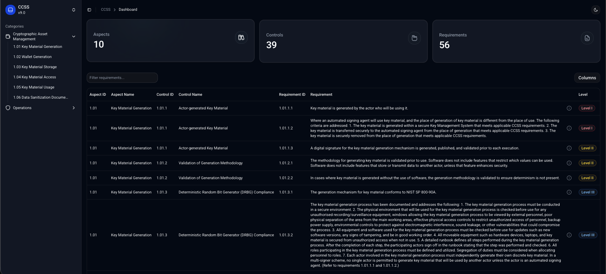

# CCSS Dashboard

An open-source web UI for browsing the **CryptoCurrency Security Standard (CCSS)** catalog: aspects, controls, and requirements, including level mapping and rationale.

This project is built **for the community** around the CryptoCurrency Certification Consortium and CCSS resources:
https://cryptoconsortium.org/



## About

The CCSS catalog is easier to work with when it is searchable, filterable, and presented in a consistent table format. This dashboard aims to make **CCSS easier to explore across versions** for auditors, implementers, and anyone learning the standard.

**Disclaimer:** this repository is a community-maintained UI. It is not an official source of truth for the standard. Always validate content against the official CCSS references.

## Features

- Browse CCSS **aspects**, **controls**, and **requirements** in a single table
- Filter by **Level I / II / III** (and drill down by aspect/control)
- Quick stats for number of aspects/controls/requirements
- Clean UI built with Next.js + Tailwind + shadcn/ui

## Data source

- The app loads static JSON datasets from the `data/raw/` folder.
- Domain types live in [types/ccss.ts](types/ccss.ts) and the data access layer in [lib/ccss.service.ts](lib/ccss.service.ts).

If you spot any mismatch with an official CCSS reference, please open an issue (or submit a PR) with a precise link/citation.

## Tech stack

- Next.js (App Router)
- React
- TypeScript
- Tailwind CSS
- shadcn/ui + Radix primitives

## Getting started

### Prerequisites

- Node.js 18+ (20+ recommended)
- npm (or pnpm / yarn)

### Install

```bash
npm install
```

### Run locally

```bash
npm run dev
```

Open http://localhost:3000 (it redirects to `/dashboard`).

### Useful scripts

```bash
npm run lint
npm run build
npm run start
```

## Contributing

Contributions are welcome — especially improvements to datasets, structure, and UX that help people navigate CCSS **across versions**.

- Bugs/ideas: open a GitHub issue with reproduction steps or a short proposal.
- Data fixes: update the relevant dataset under `data/raw/` and include references to the official CCSS source.
- New versions: add a new dataset file under `data/raw/` and document the source link(s).
- Code changes: keep PRs focused and consistent with the existing components (shadcn/ui patterns).

See [CONTRIBUTING.md](CONTRIBUTING.md) for local setup details and contribution guidelines.

By participating, you agree to follow the community standards in [CODE_OF_CONDUCT.md](CODE_OF_CONDUCT.md).

## Roadmap

- Support V8.1 
- Keep datasets accurate and easy to update
- Add new filters
- Add repository link(s) and contribution entry points
- Add an About page (project goals, data sources, and attribution)

## License

MIT License. See [LICENSE](LICENSE).

